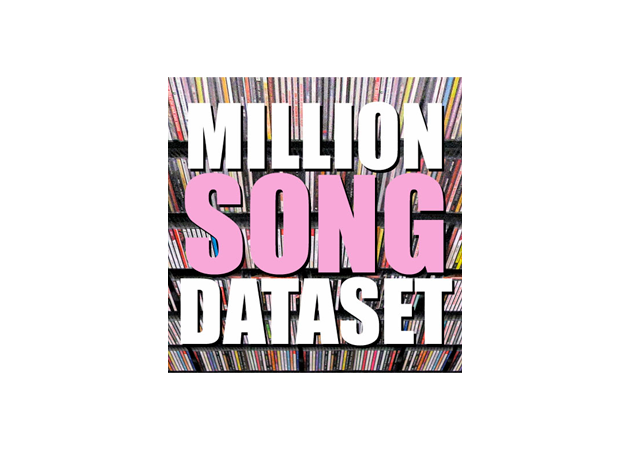

# MOVIES EDA

Proyecto realizado para el bootcamp de Data Science en The Bridge   

## Objetivo
***

Predecir las reproducciones que van a tener un conjunto de canciones en funcion del usuario que las escuche  

## Fuente
***

 
Todos los datos han sido obtenidos del dataset de Million Song Database. Contiene un histórico con metadata y preproducciones de peliculas hasta 2012. Más información en  [The Million Song Dataset](http://millionsongdataset.com/).
  

## Tecnologías utilizadas
***
- **Pandas:** Para la manipulación de datos
- **Surprise:** Creación de modelos y predicción de datos
- **Streamlit:** Presentación interactiva del proyecto

## Estructura del proyecto:
***
- presentation/: Presentación interactiva del proyecto
- src/: Fases del proyecto, desde la elección de la fuente hasta la visualización de los datos
- src/data/processed: Datos generados durante el proyecto
- src/data/raw: Datos obtenidos directamente de su fuente
- src/notebooks: Pruebas realizadas
- src/recommender: Recomendador y modelo guardado
- src/spotify: Acceso a APIs de Spotify
- src/utils: librerias externas utilizadas en el proyecto

   

**Realizado por** Daniel Vivas 
contacto@danielvivas.com

